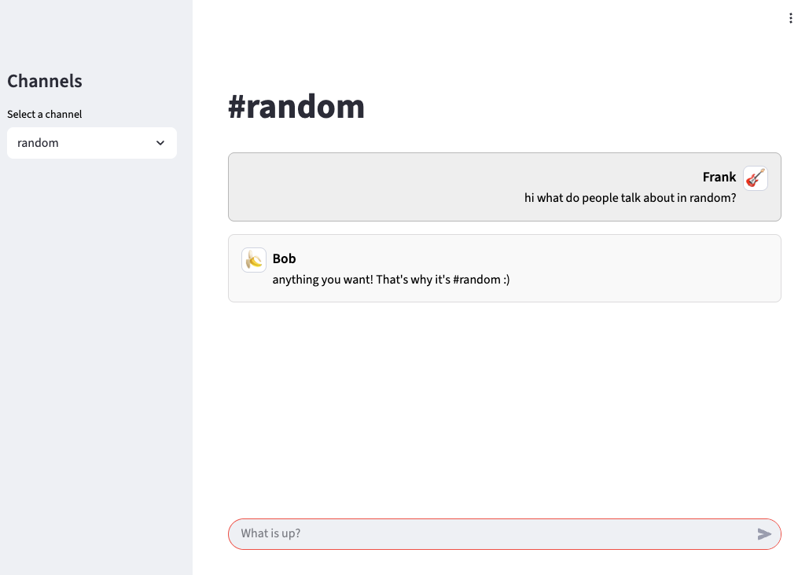
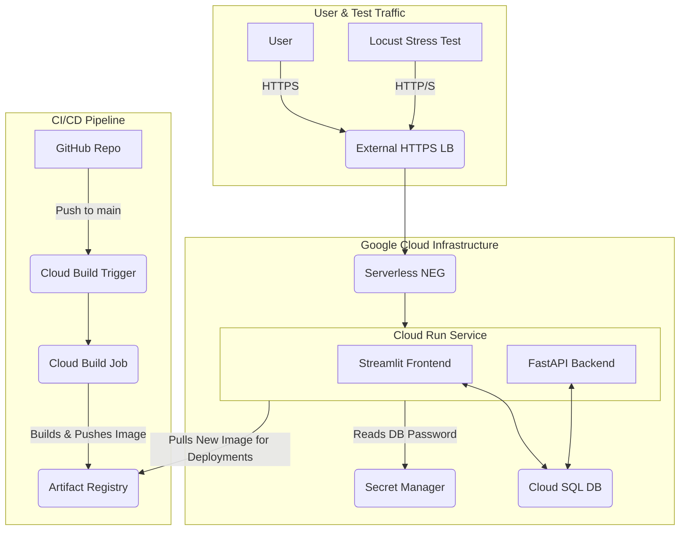

# Gemini Chat Application

A real-time chat application built with Python (Streamlit, FastAPI) and deployed on Google Cloud Platform using Terraform.



## Architecture

The infrastructure is deployed on Google Cloud Platform and managed by Terraform. The following diagram illustrates the components and traffic flow:



## Tech Stack

-   **Application:** Python, Streamlit (Frontend), FastAPI (Backend)
-   **Database:** Google Cloud SQL (PostgreSQL)
-   **Deployment:** Docker, Google Cloud Run
-   **Infrastructure:** Terraform, Google Cloud Load Balancing, Secret Manager
-   **CI/CD:** Google Cloud Build, Artifact Registry, GitHub
-   **Load Testing:** Locust

## Project Structure

The Terraform configuration is modularized for clarity and independent deployment of components.

```
.
├── Dockerfile
├── entrypoint.sh
├── requirements.txt
├── src/                # Python application source code
├── stress/             # Locust stress test files
└── terraform/
    ├── main.tf         # Root module to orchestrate deployment
    ├── terraform.tfvars
    ├── variables.tf
    ├── infra/          # Networking, IAM, and Load Balancer
    ├── app/            # Cloud Run, Cloud SQL, and the build process
    └── cicd/           # Cloud Build trigger for GitHub integration
```

## Deployment

This project uses a modular Terraform setup. The infrastructure is deployed in layers, with dependencies managed automatically.

### Prerequisites

-   A Google Cloud Platform project with the required APIs enabled.
-   [Google Cloud SDK](https://cloud.google.com/sdk/install) authenticated (`gcloud auth application-default login`).
-   [Terraform](https://learn.hashicorp.com/tutorials/terraform/install-cli) installed.
-   A GitHub repository connected to Google Cloud Build.

### Steps

1.  **Configure Terraform:**
    -   Update `terraform/terraform.tfvars` with your GCP `project_id`, `github_owner`, and `github_repo_name`.

2.  **Deploy Infrastructure:**
    Navigate to the `terraform` directory and run the standard Terraform commands.
    ```bash
    cd terraform
    terraform init
    terraform apply -auto-approve
    ```
    This command will:
    -   Provision the base infrastructure (`infra` module).
    -   Build the Docker image and push it to Artifact Registry (`app` module).
    -   Deploy the Cloud Run service and Cloud SQL database (`app` module).
    -   Create the Cloud Build trigger for CI/CD (`cicd` module).

## Load Testing

The project includes a load test using [Locust](https://locust.io/) to simulate user traffic. The test is defined in `stress/locustfile.py` and simulates two types of users:
-   **Readers:** Browse the Streamlit frontend, generating read load on the database.
-   **Writers:** Post messages directly to the FastAPI backend, generating write load.

### Running the Test

1.  **Install Locust:**
    ```bash
    pip install locust
    ```

2.  **Run the Test:**
    Execute the following command from the project root, replacing the host with your application's URL.
    ```bash
    locust -f stress/locustfile.py --host https://your-app-url.com --users 100 --spawn-rate 10 --run-time 5m --headless
    ```

## License

This project is licensed under the terms of the Apache 2.0 License.
