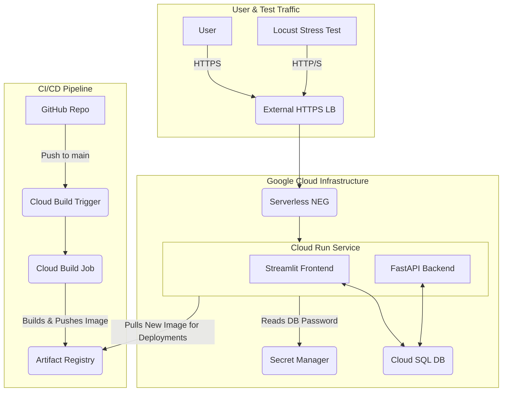

```mermaid
graph TD
    subgraph "User & Test Traffic"
        User[<fa:fa-user> User] -->|HTTPS| LB(External HTTPS LB)
        StressTest[<fa:fa-rocket> Locust Stress Test] -->|HTTP/S| LB
    end

    subgraph "Google Cloud Infrastructure"
        LB --> NEG(Serverless NEG)
        NEG --> CloudRun(Cloud Run Service)

        subgraph CloudRun [Cloud Run Service]
            direction LR
            Streamlit[<fa:fa-window-maximize> Streamlit Frontend]
            FastAPI[<fa:fa-server> FastAPI Backend]
        end

        Streamlit <--> CloudSQL(Cloud SQL DB)
        FastAPI <--> CloudSQL
        CloudRun -->|Reads DB Password| SecretManager(Secret Manager)
    end

    subgraph "CI/CD Pipeline"
        direction LR
        GitHub[<fa:fa-github> GitHub Repo] --Push to main--> CBTrigger(Cloud Build Trigger)
        CBTrigger --> CloudBuild(Cloud Build Job)
        CloudBuild --Builds & Pushes Image--> ArtifactRegistry(Artifact Registry)
        CloudRun --Pulls New Image for Deployments--> ArtifactRegistry
    end
```